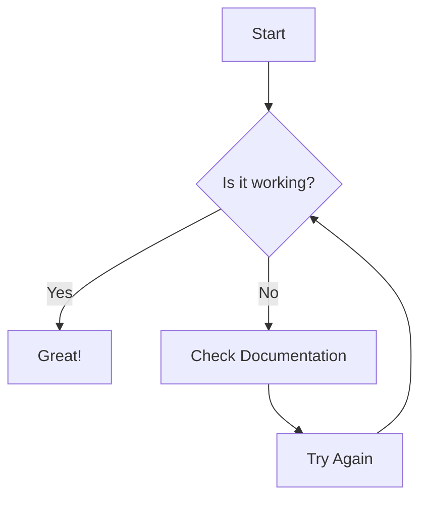

# Perspective matters

Platformer where the mechanics is about you, the player, looking from the right position at the right time.

note: I'm currently working on the architecture for a modular and lightweight experience.
I'm opting for single point entry with an event driven architecture (with centralized channel) and scriptable objects (both as data and asset).
Nothing is settled, and I'm also discovering some patterns as I go, which is why it's not as clean as it could be yet.

## Architecture flow at start (on going)

